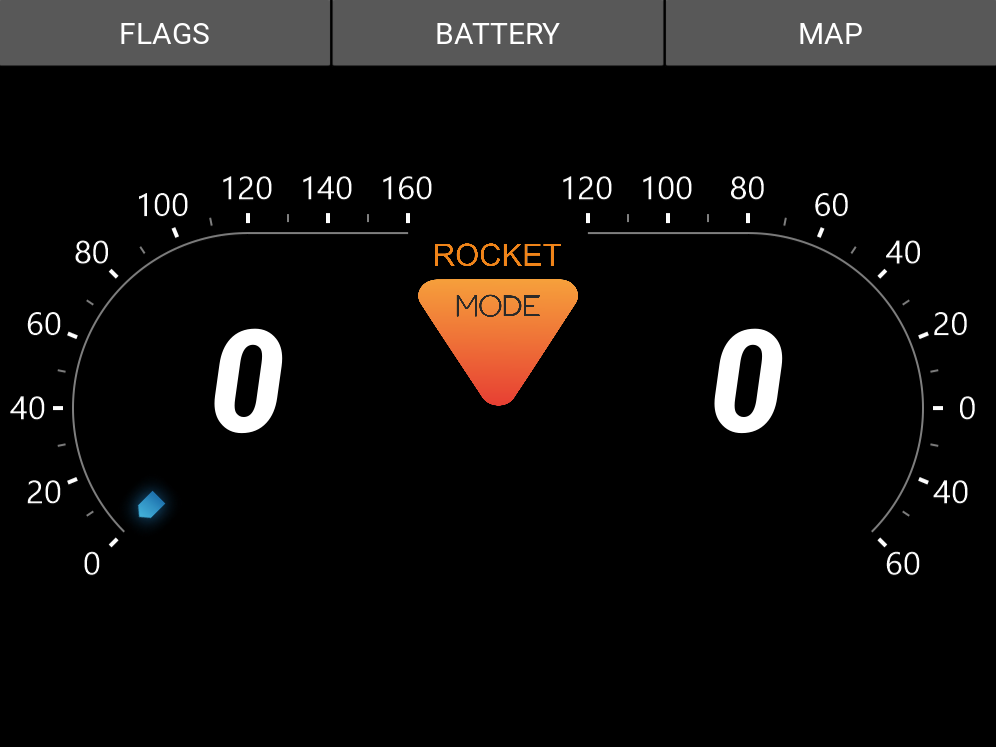
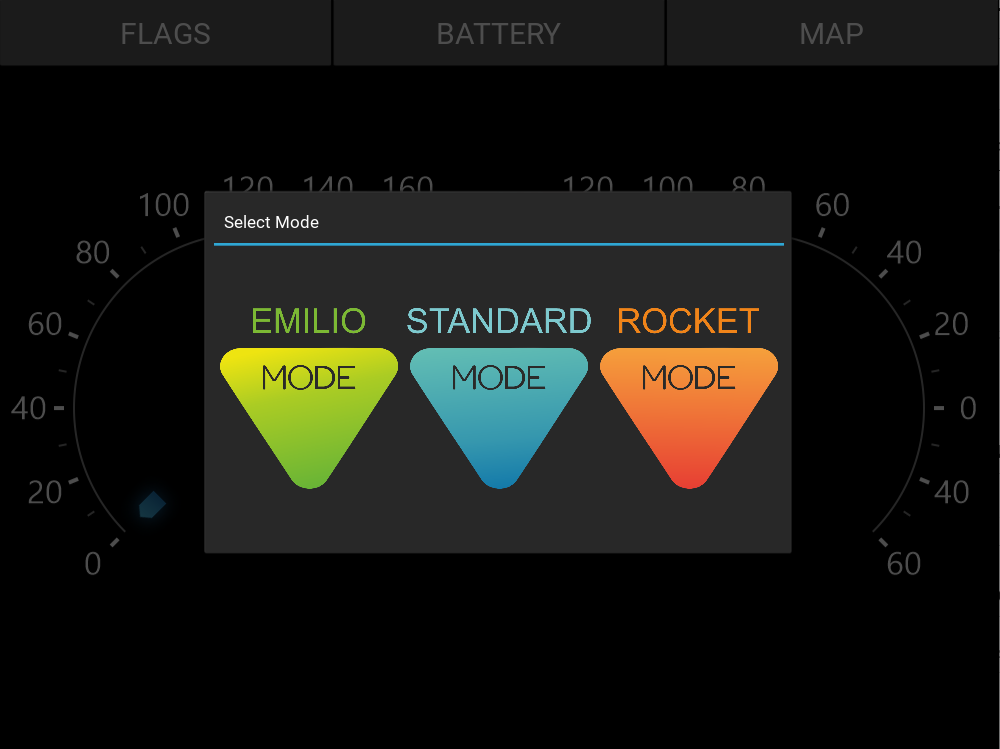
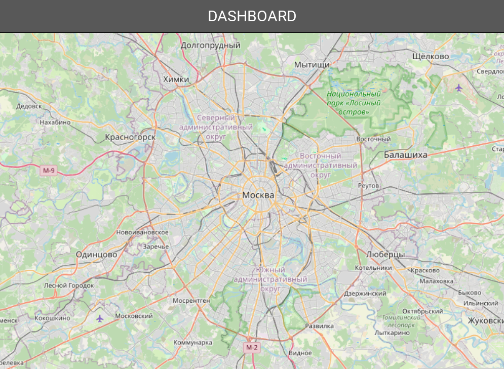

# Приборная панель электромотоцикла

**Описание**

Приборная панель предназначена для управления и контроля электромотоциклом. Устройство может быть интегрировано в приборную панель электромотоцикла или же установленно на мобильный девайс и выводить следующие параметры:

 - Скорость
 - Мощность
 - Рекуперация
 - Заряд ячеек аккумулятора
 - режим работы
 - навигация
 
Устройство функционирует на одноплатном компьютере Raspberry Pi, в качестве фреймворке выбран Kivy. Приложение управляет несколькими экранами, взаимодействует с GPIO интерфейсом и CAN шиной.

Приборная панель разработана для электромотоцикла SmartMoto RUDN, предназначенного для участия в соревнованиях SmartMoto Challenge, проходящие в Испании.

**Скришноты**






**Структура файлов**

`main.py` - основной скрипт для запуска приложения

`sources` - исходные файлы с классами, для виджетов отдельные директории

`makets` - макеты, промежуточные варианты

`images` - директория с рабочими изображениями

**Как установить**
> Python версии 3.12
```bash
py -m venv venv
source venv/Scripts/activate
pip intall -r requirements.txt
```
